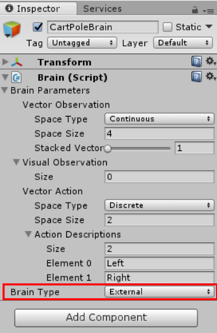

# Unity_RL
## このリポジトリについて
技術書典4 き19 Rosenblock Chainersにて頒布を行った，【進化計算と強化学習の本３】の"Unityで強化学習を始めよう 〜ML-AgentsでCartPole作成〜"で用いたコードを公開しています．
（【進化計算と強化学習の本３】は，以下のリンクにて電子版を頒布しています．
https://rosenblock.booth.pm/items/828558
）

[Unity ML-Agents](https://github.com/Unity-Technologies/ml-agents)を用いて作成した[CartPole](https://en.wikipedia.org/wiki/Inverted_pendulum)環境シーン，および学習に用いるpythonコードを公開しています．


## 動画
以下のサムネ画像は，ML-Agentsを用いて作成したCartPole環境をエージェントが学習している様子を確認できる動画へのリンクです．

[](http://www.youtube.com/watch?v=mH33VywXPOQ)

## 【進化計算と強化学習の本３】を持っている方向け
CartPole環境シーンを自分で作成する場合，【進化計算と強化学習の本３】に詳細な手順が示されているので，そちらを参考に進めてください．

このリポジトリ内に入っているCartPoleSampleシーンを使って実験を行いたい場合は，「【進化計算と強化学習の本３】を持っていない方向け」章を参考に進めてください．


## 【進化計算と強化学習の本３】を持っていない方向け
### 動作環境
#### Unity
CartPoleシーンを動かすためには，Unity 2017.1以降のバージョンが必要になります．

Unityは，[公式サイト](https://unity3d.com/jp)からダウンロードしてください．

#### Python
学習アルゴリズムは，Python3系で動作します．
主に，以下のライブラリが必要になります．

* TensorFlow
* Numpy
* Pillow

また，学習ログの推移を出来るようにするためには，以下のライブラリが必要になります．

* Tensorboard

以上のライブラリをインストールためには，以下の`python`フォルダに移動して，以下のコマンドを実行してください．

```
cd python
pip3 install -r requirement.txt
```

上記のコマンドを打っても`TensorFlow`などのインストールに失敗した場合，[Unity公式によるインストール手順](https://github.com/Unity-Technologies/ml-agents/blob/master/docs/Installation.md)を参考にしてみてください．


## 学習実行
CartPoleSample環境でエージェントの学習を実行させる場合，以下の手順を行ってください．

### CartPoleSample環境シーンのビルド
#### CartPoleSample環境シーンの起動
1. Unityを起動します．
2. Projectsダイアログで，ウィンドウの上部にある**Open**オプションを選択します．
3. ファイルダイアログを使用して，Unity_RLフォルダ内の`unity-environment`フォルダを探し，**Open**をクリックします．
4. `Project`ウィンドウで，`Assets/ML-Agents/Examples/CartPoleSample/`フォルダに移動します．
5. `CartPoleSample`ファイルをダブルクリックして，CartPoleSample環境シーンをロードします．


#### BrainをExternalに設定
1. **Scene**ウィンドウで，CartPoleAcademyオブジェクトの横にある三角形のアイコンをクリックします．
2. その子オブジェクト`CartPoleBrain`を選択します．
3. Inspectorウィンドウで，**Brain Type**を`External`に設定します．



#### 環境をビルド
1. プレイヤー設定（menu: **Edit** > **Project Settings** > **Player**）を開きます．
2. **Resolution and Presentation**:
    - **Run in Background**がチェックされていることを確認します．
    - **Display Resolution Dialog**がDisabledに設定されていることを確認します．
3. ビルド設定ウィンドウ（menu:**File** > **Build Settings**）を開きます．
4. ターゲットプラットフォームを選択します．
5. **Scenes in Build**リストにシーンが表示されている場合は，CartPoleSampleシーンだけがチェックされていることを確認してください（リストが空の場合，現在のシーンのみがビルドに含まれます）．
6. *Build*をクリックします:
    a. ファイルダイアログで，ML-Agentsディレクトリの`python`に移動します．
    b. ファイル名を付けて**Save**をクリックします．


### 学習を実行
#### 山登り法による学習
本リポジトリには，政策モデルのパラメータを[山登り法](https://en.wikipedia.org/wiki/Hill_climbing)によって探索する`run_hill_climbing.py`というPythonプログラムがサンプルとして実装されています．

学習を実行するためには，以下のコマンドを実行してください．

```python
python3 python/run_hill_climbing.py <env_file_path> --run_id=<run-identifier> --train
```

`--train`フラグはML-Agentsに学習モードで実行するように指定します．
`env_file_path`はさきほどビルドした実行ファイルへのパスでなければなりません．

このサンプルプログラムは，デフォルトの引数では，以下のような非常にシンプルな政策モデルを学習させます．


実行時に指定できるオプションについては，`python3 python/run_hill_climbing.py --help`コマンドで参照することができます．


### 学習ログの推移確認
TensorBoardを利用することで，学習時に累積報酬やエピソードの長さがどのように変動しているかを確認することができます．
以下のコマンドを実行すると，TensorBoardが起動します．

```
tensorboard --logdir=summaries
```

その後，`localhost:6006`を立ち上げて下さい．

TensorBoardによって，以下の推移が確認できます．

* iteration：山登り法の反復数
* total_reward：各反復毎に生成した政策パラメータの平均累積報酬
* best_total_reward：それまでの反復の中で最も良かった平均累積報酬
* episode_length：エピソードの長さ
* num_episode：エピソードの総数


## 学習済みモデルのテスト
学習を実行した際に生成された学習済みモデルを**Internal**タイプのBrainで使用するには，以下の手順を行ってください．

### TensorFlowSharpプラグインのセットアップ
1. TensorFlowSharpプラグインが`Assets`にあることを確認します．
TensorFlowSharpプラグインは[こちら](https://s3.amazonaws.com/unity-ml-agents/0.3/TFSharpPlugin.unitypackage)からダウンロードできます．
ダウンロードしたファイルをダブルクリックしてインポートします．
正常にインストールされたかどうかは，`Assets` -> `ML-Agents` -> `Plugins` -> `Computer`のProjectタブのTensorFlowSharpファイルをチェックすることで確認できます．
2. `Edit` -> `Project Settings` -> `Player`へ移動します．
3. ターゲットとなるプラットフォームごとに
（**`PC, Mac and Linux Standalone`**，**`iOS`** or **`Android`**）:
    1. `Other Settings`に進みます．
    2. `Scripting Runtime Version`を`Experimental (.NET 4.6 Equivalent)`にします．
    3. `Scripting Defined Symbols`に，`ENABLE_TENSORFLOW`フラグを追加します．
    入力後，Enterキーを押します．
4. `File` -> `Save Project`．
5. Unity Editorを再起動します．


### 学習済みモデルをUnityへインポート
1. 学習済みモデルは，`Unity_RL`フォルダ内の`models/<run-identifier>`に保存されます．
学習が完了すると，`<env_name>.bytes`ファイルがフォルダ内にあります．
`<env_name>`は学習中に使用される実行ファイル名です．
2. `<env_name>.bytes`を`python/models/hill_climbing/`から`unity-environment/Assets/ML-Agents/Examples/CartPoleSample/TFModels/`に移動します．
※ 本リポジトリには，サンプルのモデルファイルである`CartPoleSample_hill_climbing.byte`が既に`unity-environment/Assets/ML-Agents/Examples/CartPoleSample/TFModels/`内に用意されています．
新しく作ったモデルファイルとファイル名が被ってしまった場合には，削除するなりしてください．
3. Unity Editorを開き，上述のようにして`CartPoleSample`シーンを選択します．
4. Scene hierarchyから`CartPoleBrain`オブジェクトを選択します．
5. `Brain Type`を`Internal`に変更します．
6. EditorのProjectウィンドウから`<env_name>.bytes`ファイルを`CartPoleBrain` Inspector ウィンドウの`Graph Model` placeholderにドラッグします．
7. Editorの上部にあるPlayボタンを押します．

Unity EditorのGameビューでPole（棒）を倒立させるようにCartが動いていれば（あるいは，動きが緻密すぎてほとんど動いていないように見えることもあります）成功です！


